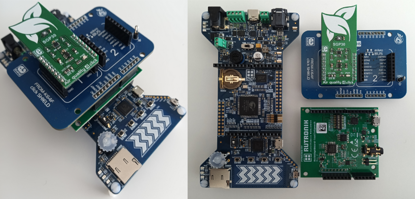

# RutDevKit-PSoC62 RutCO2Alarm

Rutronik Development Kit Programmable System-on-Chip CY8C6245AZI-S3D72 "RutCO2Alarm" Application. 

This application demonstrates the Epson's S1V3G340  Text-to-Speech Engine IC and Sensirion's SGP30 Air Quality sensor capabilities.

 

### Using the code example with a ModusToolbox IDE:

1. Import the project: **File** > **Import...** > **General** > **Existing Projects into Workspace** > **Next**.
2. Select the directory where **"RutDevKit-PSoC62_RutCO2Alarm"** resides and click  **Finish**.
3. Select and build the project **Project ** > **Build Project**.

### Operation

The firmware example connects with Windows application via USB Type-C as a "Generic HID" device and represents the carbon dioxide equivalent values in ppm that are read from SGP30 sensor. The Text-to-Speech IC is used for audible voice announcements. The LED1 on the RutDevKit-PSoC62 board will be blinking if the USB HID connection is established and active.

 A new RutAdaptBoard-TextToSpeech board has to be programmed with audio files using "Rutronik Epson Tool" that are already prepared and provided  with the RutDevKit-PSoC62 RutCO2Alarm project.

### Hardware 

This demo consists of  RutDevKit-PSoC62 development kit, RutAdaptBoard-TextToSpeech Arduino shield and SGP30 click-board with Arduino adapter.

### Debugging

If you successfully have imported the example, the debug configurations are already prepared to use with a the KitProg3, MiniProg4, or J-link. Open the ModusToolbox perspective and find the Quick Panel. Click on the desired debug launch configuration and wait for the programming completes and debug process starts.

## Legal Disclaimer

The evaluation board including the software is for testing purposes only and, because it has limited functions and limited resilience, is not suitable for permanent use under real conditions. If the evaluation board is nevertheless used under real conditions, this is done at one’s responsibility; any liability of Rutronik is insofar excluded. 

